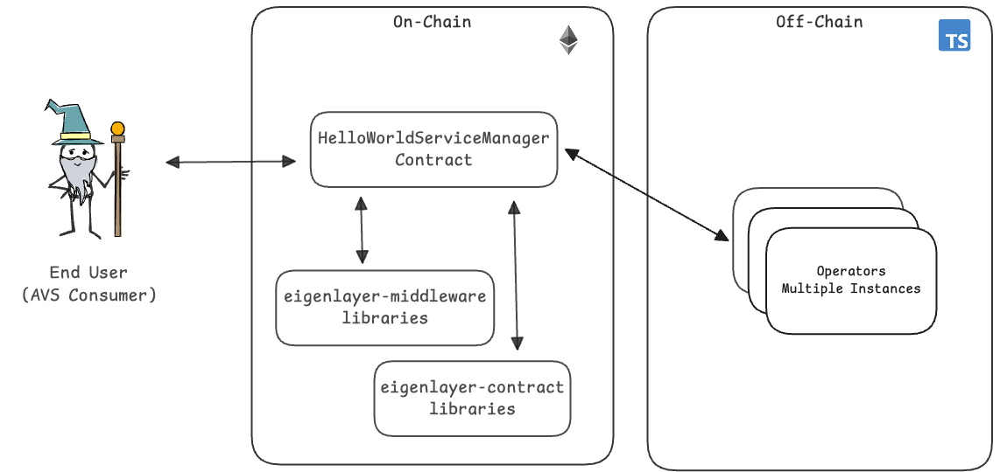

# Hello World AVS

Welcome to the Hello World AVS. This project shows you the simplest functionality you can expect from an AVS. It will give you a concrete understanding of the basic components. For new users, please find [this video walkthrough](https://drive.google.com/file/d/1P6uA6kYWCbpeorTjADuoTlQ-q8uqwPZf/view?usp=sharing) of the hello world AVS repository.

## Architecture



### AVS User Flow

1. AVS consumer requests a "Hello World" message to be generated and signed.
2. HelloWorld contract receives the request and emits a NewTaskCreated event for the request.
3. All Operators who are registered to the AVS and has staked, delegated assets takes this request. Operator generates the requested message, hashes it, and signs the hash with their private key.
4. Each Operator submits their signed hash back to the HelloWorld AVS contract.
5. If the Operator is registered to the AVS and has the minimum needed stake, the submission is accepted.

That's it. This simple flow highlights some of the core mechanics of how AVSs work.

# Local Devnet Deployment

The following instructions explain how to manually deploy the AVS from scratch including EigenLayer and AVS specific contracts using Foundry (forge) to a local anvil chain, and start Typescript Operator application and tasks.

## Development Environment

This section describes the tooling required for local development.

### Non-Nix Environment

Install dependencies:

- [Node](https://nodejs.org/en/download/)
- [Typescript](https://www.typescriptlang.org/download)
- [ts-node](https://www.npmjs.com/package/ts-node)
- [tcs](https://www.npmjs.com/package/tcs#installation)
- [npm](https://docs.npmjs.com/downloading-and-installing-node-js-and-npm)
- [Foundry](https://getfoundry.sh/)
- [ethers](https://www.npmjs.com/package/ethers)

### Nix Environment

On [Nix](https://nixos.org/) platforms, if you already have the proper Nix configuration, you can build the project’s artifacts inside a `nix develop` shell

```sh
nix develop
```

Otherwise, please refer to [installed and configured](./docs/nix-setup-guide.md) section.

## Quick start

### Start Anvil Chain

In terminal window #1, execute the following commands:

```sh
# Install npm packages
bun install

# Start local anvil chain
bun run start:anvil
```

以下のようになれば OK!

```bash
$ anvil


                             _   _
                            (_) | |
      __ _   _ __   __   __  _  | |
     / _` | | '_ \  \ \ / / | | | |
    | (_| | | | | |  \ V /  | | | |
     \__,_| |_| |_|   \_/   |_| |_|

    0.1.0 (87bc53f 2023-06-17T01:52:25.734840000Z)
    https://github.com/foundry-rs/foundry

Available Accounts
==================

(0) "0xf39Fd6e51aad88F6F4ce6aB8827279cffFb92266" (10000 ETH)
(1) "0x70997970C51812dc3A010C7d01b50e0d17dc79C8" (10000 ETH)
(2) "0x3C44CdDdB6a900fa2b585dd299e03d12FA4293BC" (10000 ETH)
(3) "0x90F79bf6EB2c4f870365E785982E1f101E93b906" (10000 ETH)
(4) "0x15d34AAf54267DB7D7c367839AAf71A00a2C6A65" (10000 ETH)
(5) "0x9965507D1a55bcC2695C58ba16FB37d819B0A4dc" (10000 ETH)
(6) "0x976EA74026E726554dB657fA54763abd0C3a0aa9" (10000 ETH)
(7) "0x14dC79964da2C08b23698B3D3cc7Ca32193d9955" (10000 ETH)
(8) "0x23618e81E3f5cdF7f54C3d65f7FBc0aBf5B21E8f" (10000 ETH)
(9) "0xa0Ee7A142d267C1f36714E4a8F75612F20a79720" (10000 ETH)

Private Keys
==================

(0) 0xac0974bec39a17e36ba4a6b4d238ff944bacb478cbed5efcae784d7bf4f2ff80
(1) 0x59c6995e998f97a5a0044966f0945389dc9e86dae88c7a8412f4603b6b78690d
(2) 0x5de4111afa1a4b94908f83103eb1f1706367c2e68ca870fc3fb9a804cdab365a
(3) 0x7c852118294e51e653712a81e05800f419141751be58f605c371e15141b007a6
(4) 0x47e179ec197488593b187f80a00eb0da91f1b9d0b13f8733639f19c30a34926a
(5) 0x8b3a350cf5c34c9194ca85829a2df0ec3153be0318b5e2d3348e872092edffba
(6) 0x92db14e403b83dfe3df233f83dfa3a0d7096f21ca9b0d6d6b8d88b2b4ec1564e
(7) 0x4bbbf85ce3377467afe5d46f804f221813b2bb87f24d81f60f1fcdbf7cbf4356
(8) 0xdbda1821b80551c9d65939329250298aa3472ba22feea921c0cf5d620ea67b97
(9) 0x2a871d0798f97d79848a013d4936a73bf4cc922c825d33c1cf7073dff6d409c6

Wallet
==================
Mnemonic:          test test test test test test test test test test test junk
Derivation path:   m/44'/60'/0'/0/


Base Fee
==================

1000000000

Gas Limit
==================

30000000

Genesis Timestamp
==================

1737180620

Listening on 127.0.0.1:8545
```

### Deploy Contracts and Start Operator

Open a separate terminal window #2, execute the following commands

設定すべき環境変数は `.env.example`ファイルを確認すること！！

```sh
# Setup .env file
cp .env.example .env
cp contracts/.env.example contracts/.env
forge install

# Updates dependencies if necessary
bun install
# builds the contracts
bun run build

# test smart contract
bun run test:contract

# Deploy the EigenLayer contracts
bun run deploy:core

# Deploy the Hello World AVS contracts
bun run deploy:hello-world

# (Optional) Update ABIs
bun run extract:abis

# Start the Operator application
bun run start:operator

```

### Create and Claim Payments

In a terminal, start a new instance of anvil and deploy the core and avs contracts

```sh
# Start anvil
bun run start:anvil-quick
# Deploy the EigenLayer contracts
bun run deploy:core

# Deploy the Hello World AVS contracts
bun run deploy:hello-world

```

In another terminal, run:

```sh
# Create payment roots
bun run create-payments-root

# Claim created payment
bun run claim-payments
```

To run operator directed payments, run:

```sh
#Create payment roots
bun run create-operator-directed-payments-root

# Claim created payment
bun run claim-payments
```

In order to create and claim multiple payments (run the above two commands more than once), you must wait up to 5 minutes.

### Create Hello-World-AVS Tasks

Open a separate terminal window #3, execute the following commands

```sh
# Start the createNewTasks application
bun run start:traffic
```

### Help and Support

For help and support deploying and modifying this repo for your AVS, please:

1. Open a ticket via the intercom link at [support.eigenlayer.xyz](https://support.eigenlayer.xyz).
2. Include the necessary troubleshooting information for your environment:

- Local anvil testing:
  - Redeploy your local test using `--revert-strings debug` flag via the following commands and retest: `npm run deploy:core-debug && npm run deploy:hello-world-debug`
  - Include the full stacktrace from your error as a .txt file attachment.
  - Create a minimal repo that demonstrates the behavior (fork or otherwise)
  - Steps require to reproduce issue (compile and cause the error)
- Holesky testing:
  - Ensure contracts are verified on Holesky. Eg `forge verify-contract --chain-id 17000 --num-of-optimizations 200 src/YourContract.sol:YourContract YOUR_CONTRACT_ADDRESS`
  - Send us your transaction hash where your contract is failing. We will use Tenderly to debug (adjust gas limit) and/or cast to re-run the transaction (eg `cast call --trace "trace_replayTransaction(0xTransactionHash)"`).

### Contact Us

If you're planning to build an AVS and would like to speak with a member of the EigenLayer DevRel team to discuss your ideas or architecture, please fill out this form and we'll be in touch shortly: [EigenLayer AVS Intro Call](https://share.hsforms.com/1BksFoaPjSk2l3pQ5J4EVCAein6l)

### Disclaimers

- This repo is meant currently intended for _local anvil development testing_. Holesky deployment support will be added shortly.
- Users who wish to build an AVS for Production purposes will want to migrate from the `ECDSAServiceManagerBase` implementation in `HelloWorldServiceManager.sol` to a BLS style architecture using [RegistryCoordinator](https://github.com/Layr-Labs/eigenlayer-middleware/blob/dev/docs/RegistryCoordinator.md).

# Appendix (Future Capabilities In Progress)

## Adding a New Strategy

## Potential Enhancements to the AVS (for learning purposes)

The architecture can be further enhanced via:

- the nature of the request is more sophisticated than generating a constant string
- the operators might need to coordinate with each other
- the type of signature is different based on the constraints of the service
- the type and amount of security used to secure the AVS

## Rust Operator instructions

### Anvil Deployment

1. Start Anvil Chain

In terminal window #1, execute the following commands:

```sh
anvil
```

2. Deploy Contracts

Open a separate terminal window #2, execute the following commands

```
make deploy-eigenlayer-contracts

make deploy-helloworld-contracts
```

3. Start Operator

```sh
make start-rust-operator
```

4. Spam Tasks

```sh
make spam-rust-tasks
```

### Testing

1. Start Anvil Chain

In terminal window #1, execute the following commands:

```sh
anvil
```

2. Deploy Contracts

Open a separate terminal window #2, execute the following commands

```
make deploy-eigenlayer-contracts

make deploy-helloworld-contracts
```

3. Run this command

```
cargo test --workspace
```
